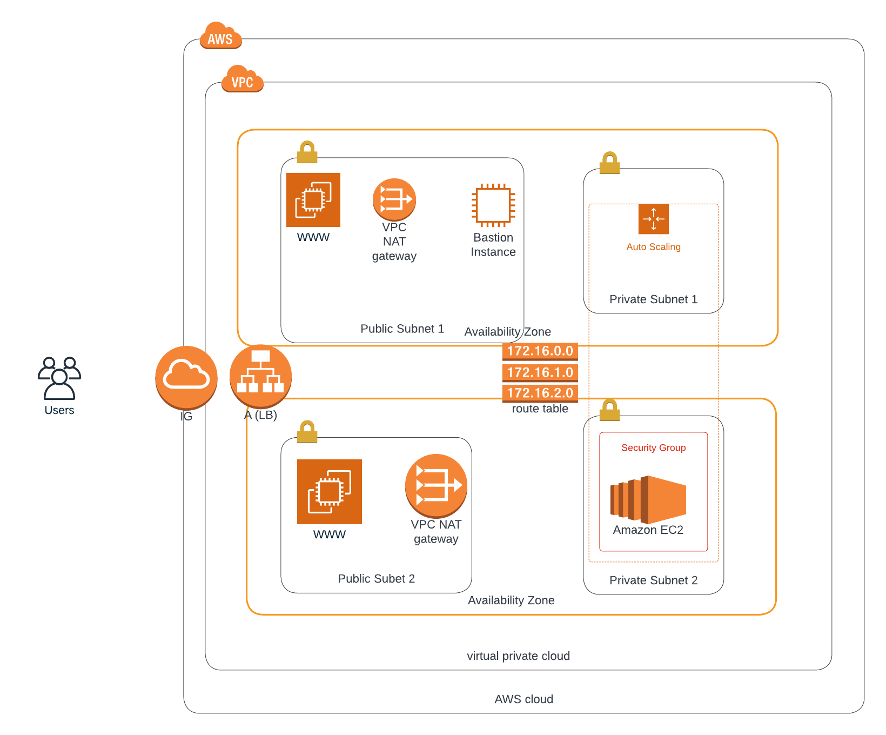

# iac-udacity
- using cloudformation to provision and configure aws resources

## A link to the running Instance
- http://udagr-webap-86sol8ph1uk3-2043974718.us-east-1.elb.amazonaws.com/

## Architectural Diagram
- Link to [Architectural Diagram](https://lucid.app/lucidchart/81ce7a86-40dd-464a-a75d-19d0cd014f34/edit?invitationId=inv_bb288cf1-7f7c-441d-a3e6-86349933325e#)
- 

## Screenshot of the running webserver
- 
